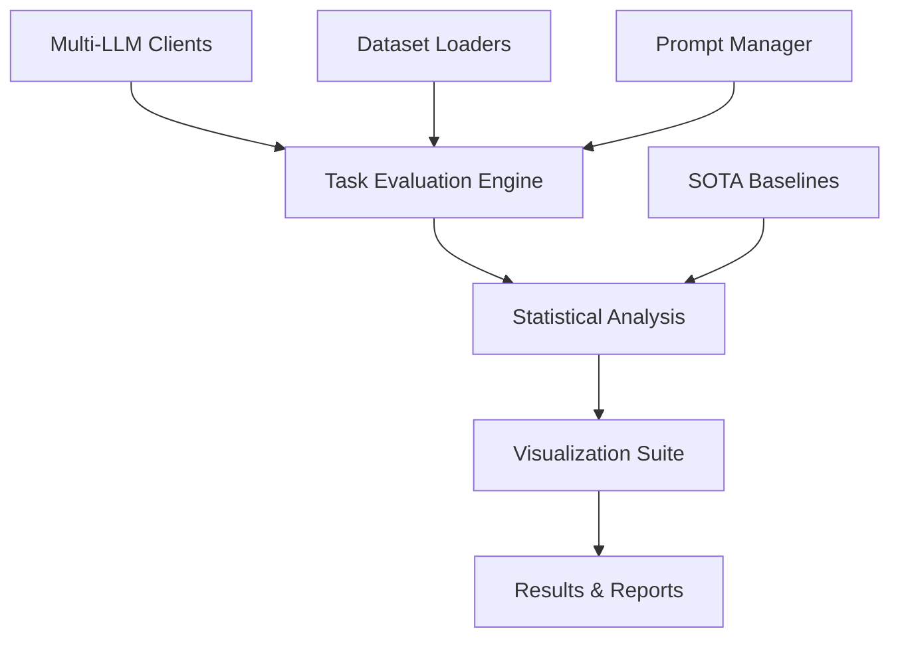

# Multi-LLM Factuality Evaluation Framework

An advanced research framework for evaluating large language models' factuality assessment capabilities across multiple tasks, datasets, and prompting strategies.

## 🎯 Overview

This project implements a comprehensive evaluation framework to systematically assess how well large language models can evaluate factual consistency in text summarization. The framework supports multiple models, prompting strategies, and provides rigorous statistical analysis with publication-quality visualizations.

### ✨ Key Features

- **🤖 Multi-Model Support**: GPT-4.1-mini, Qwen2.5:7b, Llama3.1:8b
- **📋 Three Core Tasks**: Entailment inference, summary ranking, consistency rating
- **🎯 Prompting Strategies**: Zero-shot and chain-of-thought approaches
- **📊 SOTA Baselines**: FactCC, BERTScore, ROUGE comparisons
- **📈 Advanced Analytics**: Statistical testing, confidence intervals, failure analysis
- **🎨 Rich Visualizations**: Performance charts, heatmaps, radar plots

## 🏗️ Architecture



## 🚀 Quick Start

### Installation

```bash
# Clone the repository
git clone <repository-url>
cd factuality-evaluation

# Install dependencies
pip install -r requirements.txt

# Set up environment variables
export OPENAI_API_KEY="your-api-key"
export OLLAMA_HOST="http://localhost:11434"  # For local models

# Download and preprocess datasets
python scripts/setup_data.py --quick
```

### Run Your First Evaluation

```bash
# Demo mode with enhanced output
python experiments2/run_llm_evaluation.py --demo --show-responses
```

### Basic Multi-Model Evaluation

```python
from experiments2.run_llm_evaluation import MultiLLMEvaluationExperiment

# Initialize experiment
experiment = MultiLLMEvaluationExperiment()

# Run comprehensive evaluation
await experiment.run_multi_llm_evaluations(
    models=["gpt-4.1-mini", "qwen2.5:7b", "llama3.1:8b"],
    tasks=["entailment_inference", "summary_ranking", "consistency_rating"],
    datasets=["frank", "summeval"],
    sample_size=500
)
```

## 🧪 Available Experiments

### 1. Multi-LLM Evaluation (`run_llm_evaluation.py`)

**Purpose**: Comprehensive evaluation across all models and tasks

**Features**:
- ✅ Multi-model comparison with statistical analysis
- ✅ Enhanced demo mode with ANSI colors and detailed output
- ✅ Comprehensive visualizations (bar charts, radar charts, heatmaps)
- ✅ Performance tables with confidence intervals
- ✅ Failure mode analysis and error categorization

**Usage**:
```bash
python experiments2/run_llm_evaluation.py \
  --models gpt-4.1-mini qwen2.5:7b llama3.1:8b \
  --tasks entailment_inference summary_ranking consistency_rating \
  --datasets frank summeval \
  --sample-size 1000 \
  --demo --show-responses
```

### 2. SOTA Baseline Comparison (`sota_multi_comparison.py`)

**Purpose**: Compare LLMs against state-of-the-art factuality metrics

**Features**:
- ✅ FactCC, BERTScore, and ROUGE baseline implementations
- ✅ Statistical significance testing
- ✅ Comparative performance analysis
- ✅ Academic-quality result tables

**Usage**:
```bash
python experiments2/sota_multi_comparison.py \
  --models gpt-4.1-mini \
  --sample-size 500 \
  --include-baselines factcc bertscore rouge
```

### 3. Zero-Shot vs Chain-of-Thought Analysis (`compare_zero_shot_vs_cot_visualizations.py`)

**Purpose**: Comprehensive analysis of prompting strategies

**Features**:
- ✅ Statistical testing of prompting strategy effectiveness
- ✅ Performance degradation analysis
- ✅ Task-specific strategy recommendations
- ✅ Publication-ready visualizations

**Usage**:
```bash
python experiments2/compare_zero_shot_vs_cot_visualizations.py \
  --models gpt-4.1-mini qwen2.5:7b \
  --tasks entailment_inference summary_ranking \
  --sample-size 300
```

## 🗃️ Dataset Support

| Dataset | Size | Domain | Tasks | Status |
|---------|------|--------|-------|--------|
| **FRANK** | 2,246 examples | News Summarization | All three tasks | ✅ Ready |
| **SummEval** | 1,700 examples | News Summarization | All three tasks | ✅ Ready |

### Automated Data Processing

```python
# One-line dataset loading with full preprocessing
from src.data import FrankLoader, SummEvalLoader

# Load datasets with automatic preprocessing
frank_data = FrankLoader().load_dataset(max_examples=1000)
summeval_data = SummEvalLoader().load_dataset(max_examples=1000)

# Features:
# ✅ Automatic cleaning and validation
# ✅ Task-specific formatting
# ✅ Quality filtering and caching
# ✅ Randomization with fixed seed (42)
```

## 🤖 Supported Models

### OpenAI Models
- **GPT-4.1-mini** (Tier 2): High-performance, cost-effective
  - Cost tracking: $0.00015 per 1K input tokens
  - Optimized for factuality evaluation tasks

### Ollama Models (Local Deployment)
- **Qwen2.5:7b**: Alibaba's latest 7B parameter model
- **Llama3.1:8b**: Meta's Llama 3.1 8B parameter model

### Model Configuration

```yaml
# config/models/gpt-4.1-mini_tier2.yaml
model_name: "gpt-4.1-mini"
provider: "openai"
temperature: 0.0
max_tokens: 150
tier: "tier2"
cost_per_input_token: 0.00000015
cost_per_output_token: 0.0000006
```

## 📊 Evaluation Tasks

### 1. 🔍 Entailment Inference

**Objective**: Binary classification of factual consistency

```python
from src.tasks import EntailmentInferenceTask

task = EntailmentInferenceTask()
result = await task.evaluate_example(example, model_client)
# Output: ENTAILMENT (1) or CONTRADICTION (0)
```

**Evaluation Metrics**:
- Accuracy, Precision, Recall, F1-Score
- Confusion matrix analysis
- Per-class performance breakdown

**Prompt Example**:
```plaintext
Determine if the summary is factually consistent with the source text.

ENTAILMENT = factually consistent
CONTRADICTION = contains factual errors

SOURCE: [document text]
SUMMARY: [summary text]

CLASSIFICATION: 
```

### 2. 📊 Summary Ranking

**Objective**: Rank multiple summaries by factual consistency

```python
from src.tasks import SummaryRankingTask

task = SummaryRankingTask()
result = await task.evaluate_example(example, model_client)
# Output: [1, 3, 2] (ranking of summaries, 1=best)
```

**Evaluation Metrics**:
- Kendall's Tau correlation
- Spearman rank correlation
- Normalized Discounted Cumulative Gain (NDCG)

### 3. ⭐ Consistency Rating

**Objective**: Fine-grained 0-100 scale factuality ratings

```python
from src.tasks import ConsistencyRatingTask

task = ConsistencyRatingTask()
result = await task.evaluate_example(example, model_client)
# Output: 0-100 rating score
```

**Evaluation Metrics**:
- Pearson correlation with human judgments
- Mean Absolute Error (MAE)
- Root Mean Square Error (RMSE)
- Agreement within thresholds (±5, ±10)

## 📈 SOTA Baseline Comparisons

### Implemented Baselines

```python
from src.baselines import SOTAMetrics

metrics = SOTAMetrics()

# FactCC: Factual consistency classifier
factcc_score = metrics.evaluate_factcc(source, summary)

# BERTScore: Semantic similarity with BERT embeddings
bertscore = metrics.evaluate_bertscore(source, summary)

# ROUGE: Lexical overlap metrics
rouge_scores = metrics.evaluate_rouge(source, summary)
# Returns: ROUGE-1, ROUGE-2, ROUGE-L
```

### Baseline Performance Analysis

- **FactCC**: Transformer-based factual consistency classifier
- **BERTScore**: Contextual embeddings similarity (F1, Precision, Recall)
- **ROUGE**: N-gram overlap metrics for content preservation

## 🎨 Enhanced Visualization Suite

### Available Visualizations

1. **Performance Comparison Charts**: Multi-model accuracy comparison
2. **Task-Specific Analysis**: Detailed breakdown by evaluation task
3. **Statistical Confidence**: Bootstrap confidence intervals
4. **Radar Charts**: Multi-dimensional performance visualization
5. **Heatmaps**: Cross-model×task performance matrices
6. **Error Analysis**: Failure mode identification and categorization

### Demo Mode Output

The framework includes an enhanced demo mode with:
- 🎨 **ANSI Colors**: Colored terminal output for better readability
- 📊 **Formatted Tables**: Clean performance summaries
- 🔍 **Detailed Responses**: Raw model outputs for analysis
- ⚡ **Real-time Progress**: Live experiment tracking

## 🔧 Configuration System

### Main Configuration (`config/default.yaml`)

```yaml
project:
  name: "Multi-LLM Factuality Evaluation"
  version: "2.0.0"
  author: "Michael Ogunjimi"
  institution: "University of Manchester"

data:
  datasets: ["frank", "summeval"]
  cache_dir: "data/cache"
  processed_dir: "data/processed"
  
models:
  available: ["gpt-4.1-mini", "qwen2.5:7b", "llama3.1:8b"]
  default_temperature: 0.0
  max_retries: 3
  timeout: 60

evaluation:
  tasks: ["entailment_inference", "summary_ranking", "consistency_rating"]
  batch_size: 10
  random_seed: 42
  prompt_types: ["zero_shot", "chain_of_thought"]
```

## 📁 Project Structure

```
factuality-evaluation/
├── 📁 config/                    # Configuration management
│   ├── default.yaml             # Main project configuration
│   └── 📁 models/               # Model-specific configurations
│       ├── gpt-4.1-mini_tier2.yaml
│       ├── qwen2.5_7b.yaml
│       └── llama3.1_8b.yaml
├── 📁 data/                     # Dataset storage and processing
│   ├── 📁 raw/                  # Original JSONL datasets
│   │   ├── 📁 frank/
│   │   └── 📁 summeval/
│   ├── 📁 processed/            # Preprocessed data files
│   └── 📁 cache/                # Cached results (*.pkl)
├── 📁 experiments2/             # Main experiment scripts
│   ├── run_llm_evaluation.py           # Multi-LLM evaluation runner
│   ├── sota_multi_comparison.py        # SOTA baseline comparison
│   └── compare_zero_shot_vs_cot_visualizations.py
├── 📁 src/                      # Core framework implementation
│   ├── 📁 data/                 # Data loading & preprocessing
│   │   ├── loaders.py           # FrankLoader, SummEvalLoader
│   │   ├── processor.py         # Data processing engine
│   │   └── preprocessors.py     # Task-specific preprocessors
│   ├── 📁 tasks/                # Evaluation task implementations
│   │   ├── base_task.py         # Base task interface
│   │   ├── entailment_inference.py    # Binary classification
│   │   ├── summary_ranking.py         # Ranking task
│   │   └── consistency_rating.py      # Rating task
│   ├── 📁 llm_clients/          # Multi-provider LLM clients
│   │   └── openai_client.py     # Unified OpenAI + Ollama client
│   ├── 📁 baselines/            # SOTA metric implementations
│   │   └── sota_metrics.py      # FactCC, BERTScore, ROUGE
│   ├── 📁 prompts/              # Prompt template management
│   │   └── prompt_manager.py    # Prompt loading and formatting
│   └── 📁 utils/                # Shared utilities
│       ├── config.py            # Configuration management
│       ├── logging.py           # Structured logging
│       └── evaluation.py        # Evaluation utilities
├── 📁 prompts/                  # Prompt template library
│   ├── 📁 entailment_inference/ # Binary classification prompts
│   │   ├── zero_shot.txt
│   │   └── chain_of_thought.txt
│   ├── 📁 summary_ranking/      # Ranking prompts
│   ├── 📁 consistency_rating/   # Rating prompts
│   └── 📁 system_prompts/       # System-level prompts
├── 📁 results/                  # Experiment outputs
│   └── 📁 experiments/          # Individual experiment results
│       └── 📁 [experiment_name]/
│           ├── results.json     # Raw experimental results
│           ├── experiment_metadata.json
│           ├── 📁 tables/       # Performance summary tables
│           ├── 📁 figures/      # Generated visualizations
│           └── 📁 logs/         # Detailed execution logs
├── 📁 scripts/                  # Setup and utility scripts
│   ├── setup_environment.py    # Environment configuration
│   ├── setup_data.py           # Dataset download & preprocessing
│   └── check_environment.py    # System verification
├── 📁 tests/                    # Unit test suite
│   ├── test_data_models.py
│   ├── test_evaluation.py
│   ├── test_openai_client.py
│   └── test_tasks.py
└── 📁 docs/                     # Documentation
    ├── DATA_SYSTEM.md           # Data processing documentation
    ├── ENHANCED_VISUALIZATIONS_SUMMARY.md
    └── DYNAMIC_CONFIG_SUMMARY.md
```

## 🛠️ Core Framework Components

### Task Implementation

```python
from src.tasks.base_task import BaseFactualityTask

class CustomFactualityTask(BaseFactualityTask):
    async def evaluate_example(self, example, client):
        # Implement custom evaluation logic
        prompt = self.format_prompt(example)
        response = await client.generate_response(prompt)
        return self.parse_response(response)
```

### Multi-Provider LLM Client

```python
from src.llm_clients import LLMClient

# Supports both OpenAI and Ollama models
client = LLMClient(model_name="gpt-4.1-mini")
response = await client.generate_response(prompt)

# Automatic provider detection and cost tracking
print(f"Cost: ${response.cost:.6f}")
print(f"Tokens: {response.total_tokens}")
```

### Data Loading Pipeline

```python
from src.data import process_all_datasets, FrankLoader

# Automated preprocessing
process_all_datasets()

# Load processed data
loader = FrankLoader()
examples = loader.load_dataset(max_examples=1000)
# Returns: List[FactualityExample] with standardized format
```

## 📊 Experiment Results

### Output Structure

```
results/experiments/[experiment_name]/
├── multi_llm_evaluation/
│   ├── results.json              # Complete experimental results
│   ├── experiment_metadata.json  # Configuration and parameters
│   ├── 📁 tables/               # Performance summary tables
│   │   ├── performance_summary.csv
│   │   └── detailed_results.csv
│   ├── 📁 figures/              # Generated visualizations
│   │   ├── performance_comparison.png
│   │   ├── task_analysis.png
│   │   └── model_heatmap.png
│   └── 📁 logs/                 # Detailed execution logs
│       └── [experiment_name]_structured.jsonl
```

### Key Performance Metrics

- **📈 Task Performance**: Accuracy, correlation scores, error rates
- **⚡ Model Efficiency**: Response time, cost per evaluation, throughput
- **🔍 Failure Analysis**: Error categorization, failure mode frequency
- **📊 Statistical Significance**: Bootstrap confidence intervals, p-values

## 🔬 Research Features

### Prompting Strategy Analysis

- **Zero-Shot Prompting**: Direct task instructions without examples
- **Chain-of-Thought**: Step-by-step reasoning prompts
- **Comparative Analysis**: Statistical testing of strategy effectiveness

### Statistical Rigor

- **Bootstrap Confidence Intervals**: 95% CI for all performance metrics
- **Significance Testing**: t-tests, Mann-Whitney U tests
- **Effect Size Calculations**: Cohen's d for practical significance
- **Power Analysis**: Statistical power assessment

### Reproducibility Standards

- **Fixed Random Seeds**: Ensures reproducible results (`seed=42`)
- **Version Control**: Configuration versioning and tracking
- **Environment Snapshots**: Complete dependency tracking
- **Comprehensive Logging**: Structured logs for full audit trail

## 📚 Academic Context

This framework was developed as part of an **MSc AI thesis project** at the **University of Manchester**, focusing on systematic evaluation of LLM factuality assessment capabilities. The implementation follows academic research standards with emphasis on:

- **Rigorous Experimental Design**: Controlled variables, proper baselines
- **Statistical Validation**: Appropriate statistical tests and effect sizes  
- **Reproducibility**: Complete experimental reproducibility
- **Comprehensive Evaluation**: Multi-dimensional performance assessment

## 🚀 Getting Started Guide

### 1. Environment Setup

```bash
# Verify system requirements
python scripts/check_environment.py

# Set up complete environment
python scripts/setup_environment.py
```

### 2. Data Preparation

```bash
# Quick setup (recommended for testing)
python scripts/setup_data.py --quick

# Full setup (complete datasets)
python scripts/setup_data.py
```

### 3. Run Demo Evaluation

```bash
# Interactive demo with enhanced output
python experiments2/run_llm_evaluation.py --demo --show-responses

# Sample output:
# ✅ Loaded GPT-4.1-mini (OpenAI)
# 📊 Evaluating entailment_inference on frank dataset
# 🎯 Accuracy: 0.85 ± 0.03 (95% CI)
```

### 4. Analyze Results

- **📊 Performance Tables**: `results/experiments/[latest]/tables/`
- **📈 Visualizations**: `results/experiments/[latest]/figures/`
- **📋 Raw Data**: `results/experiments/[latest]/results.json`

## 📄 License

This project is licensed under the MIT License. See [LICENSE](LICENSE) for details.

## 👨‍🎓 Author

**Michael Ogunjimi**  
MSc Artificial Intelligence  
University of Manchester  
Email: [contact information]

---

*This framework provides a robust, academically-rigorous foundation for factuality evaluation research with comprehensive multi-model support, statistical analysis, and publication-quality results.*
